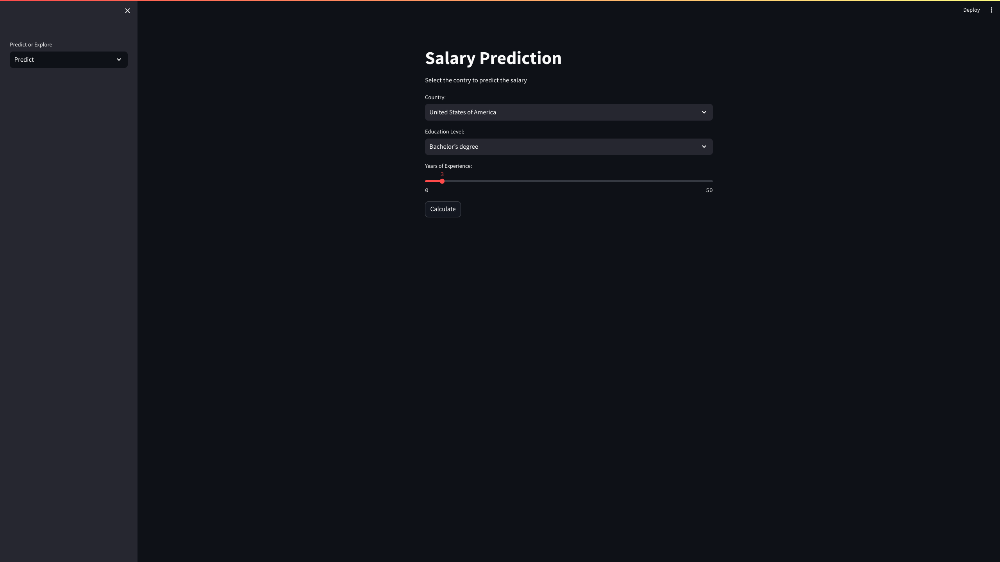

<div>
  <h1 align="center">Final Project Salary Prediction Calculator</h1>
</div>

College: `CCT College Dublin`

Module Title: `Problem-Solving for Industry`

Lecturer Name: `Dr. Muhammad Iqbal`

Student Full Name: `Marcos Vinicius de Oliveira | Mario Luis Saldanha Santos`

Students Number: `2023323 | 2023410`

Assessment Due Date: `May 17th, 2024`

Date of Submission: ``

## Introduction

In the dynamic and global field of IT growing almost daily and the amount of new opportunities professionals and companies are always seeking to improve their services. To make it easy, that is where the application comes in, helping them to predict the salary of IT professionals.
This machine-learning web application model will be built from scratch, and it aims to solve a real-world problem. For this project, we will be using the latest public 2023 stack overflow developer survey.

> In May 2023 over 90,000 developers responded to our annual survey about how they learn and level up, which tools they're using, and which ones they want. (Stack Overflow, 2023)

The main goal of this project is to gather a significant amount of previous datasets from past years for the field of software development or any other position and their salaries and train the data with machine learning to give the average salary depending on the country specified. This project will serve as a guide for both employers and professionals to stay updated in a shifting economy, and possibly hiring them.

## Dataset link: https://shorturl.at/wKMQY

## Project Sections

This project is structured as follows:

- ### 1. Exploratory Data Analysis EDA
  - #### 1.1 Importing Libraries
  - ...
- ### 2. Feature Engineering
  - #### 2.1 Renaming Salary
  - ...

## Graphs

### Salary by Country


### Salary by Age


### Salary by Working Option


### Distribution of Country


### Education Group


### Response by Age Group


## Models

1. LinearRegression
2. DecisionTreeRegressor
3. RandomForestRegressor

## Dashboard

For this project, we are using Streamlit framework, to create the dashboard.

To run streamlit, open the terminal where your app.py is and run:

1. To activate conta enviroument

```
conda activate ml
```

2. To run Streamlit

```
streamlit run app.py
```

### Predict Page



### Explore Page


## References

All references of this project were sent via CCT Moodle Report.

## Copyright Disclaimer

Please note that this project is part of CCT College, however, it may contain some part of the code that may be copyrighted, if so, please contact us so we can delete or give due to copyright. All the people were duly referenced and sent via CCT Moodle Report.

Please note this project is non-profit and not intended to be monetized.

<strong>Built with 💙 by [@Marcos Oliveira](https://www.linkedin.com/in/pgmarcosoliveira/) and [@Mario Saldanha](https://www.linkedin.com/in/mario-saldanha/)</strong>.
